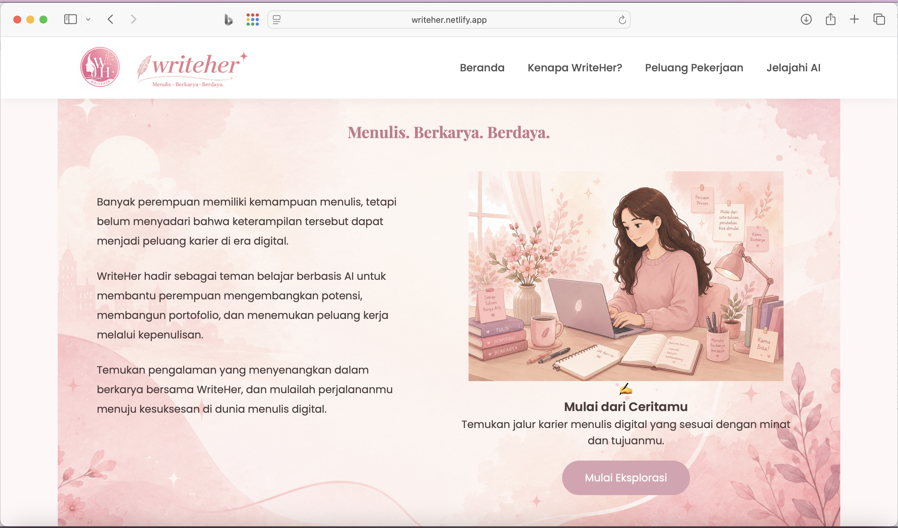
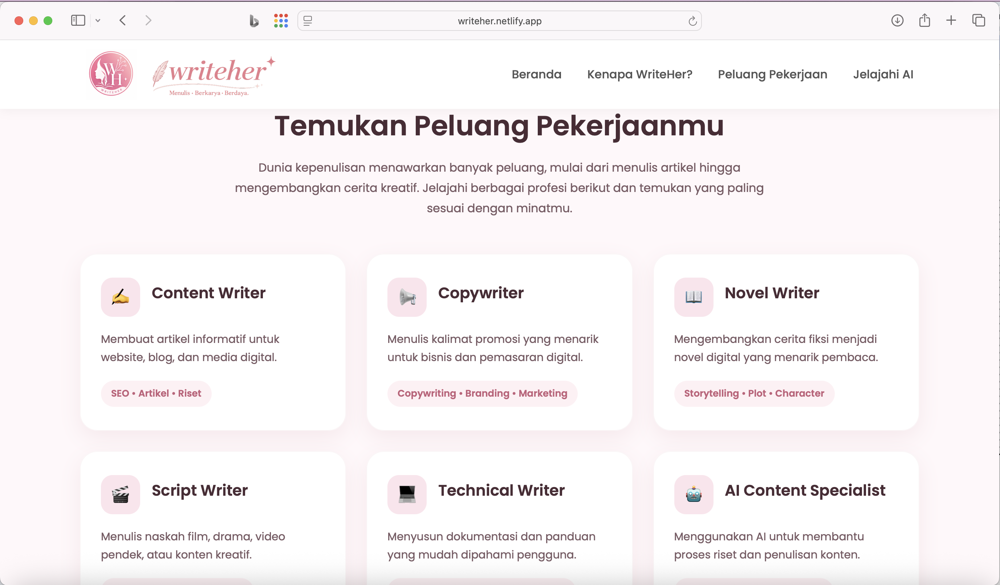
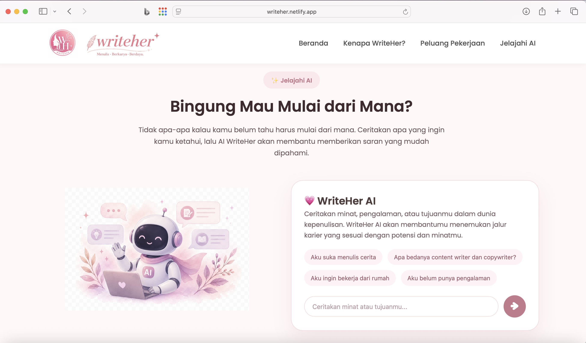

# 🌸 WriteHer

### Menulis. Berkarya. Berdaya.

WriteHer adalah landing page berbasis AI yang membantu perempuan mengeksplorasi peluang karier di bidang kepenulisan digital.

Proyek ini dibuat sebagai tugas akhir **Basic Course Perempuan Inovasi 2026** pada program **Perempuan Inovasi x IBM SkillsBuild** dengan tema **AI for Social Good**.

---

# 🌐 Live Demo

👉 https://writeher.netlify.app

---

# 📸 Preview

## 🏠 Beranda



---

## 💼 Peluang Karier



---

## 🤖 WriteHer AI



---

## 📍 Footer


---

## ✨ Fitur Utama

- Landing page responsif dengan desain modern
- Informasi peluang kerja digital di bidang kepenulisan
- Eksplorasi berbagai jalur karier:
  - Content Writer
  - Copywriter
  - Novel Writer
  - Script Writer
  - Technical Writer
  - AI Content Specialist
- Chat AI menggunakan Google Gemini
- Backend serverless menggunakan Netlify Functions
- API Key diamankan menggunakan Netlify Environment Variables

---

## 🎯 Masalah yang Diangkat

Banyak perempuan memiliki kemampuan menulis, bercerita, dan menuangkan ide kreatif. Namun belum semua memiliki akses, arahan, maupun kepercayaan diri untuk mengubah kemampuan tersebut menjadi peluang karier digital.

WriteHer hadir sebagai teman belajar berbasis AI yang membantu perempuan mengenali potensi, mengeksplorasi pilihan karier, serta memulai langkah awal menuju dunia kerja digital.

---

## 👩 Target Pengguna

- Perempuan yang ingin memulai karier digital
- Ibu rumah tangga yang ingin bekerja dari rumah
- Penulis pemula
- Perempuan yang tertarik pada dunia kepenulisan dan AI

---

## 🛠 Teknologi yang Digunakan

- HTML5
- CSS3
- JavaScript
- Google Gemini API
- Netlify Functions
- Netlify Deployment
- GitHub

---

## 🤖 Integrasi AI

WriteHer menggunakan **Google Gemini API** melalui **Netlify Functions**.

Alur kerjanya:

1. Pengguna mengirim pertanyaan melalui website.
2. Pertanyaan dikirim ke Netlify Function.
3. Function meneruskan permintaan ke Gemini API.
4. Jawaban AI dikembalikan ke website.

API Key tidak disimpan di frontend, tetapi menggunakan **Environment Variables** sehingga lebih aman.

---

## 📁 Struktur Folder

```text
WriteHer/
│
├── assets/
├── screenshots/
├── netlify/
│   └── functions/
│       └── chat.js
├── index.html
├── style.css
├── script.js
├── package.json
└── README.md
```